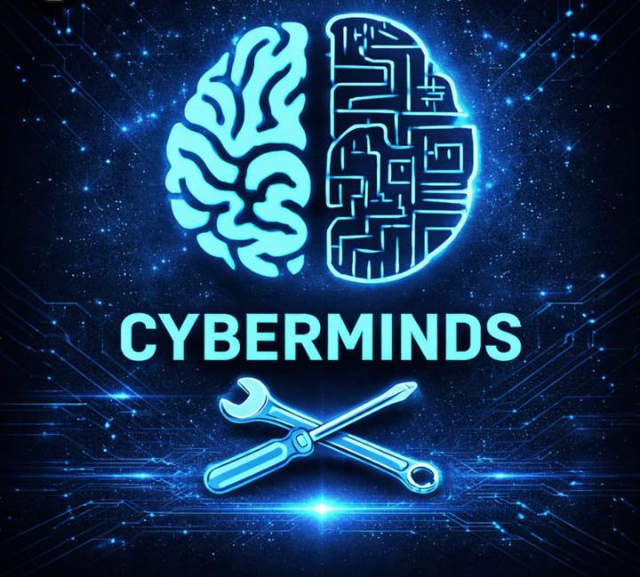

<!-- BANNER -->

  

<!-- TITLE -->
<h1 align="center">Hi, I'm Josaphat Sanogo 👋</h1>

<!-- TYPING ANIMATION -->

  

<!-- BADGES -->

  
  
  
  

---

> *"The best way to predict the future is to create it."*

---

## 👤 About Me

I am a STEM student at the **National Scientific High School of Bobo-Dioulasso (LSNB)** passionate about **Artificial Intelligence, Software Development, Cybersecurity, and Educational Technology**.

My mission is to use technology to empower students, unlock opportunities, and build impactful solutions for Africa and beyond.

Through **CyberMinds**, I work on building a community where students learn programming, AI, cybersecurity, and access opportunities.

📍 Bobo-Dioulasso, Burkina Faso  
📧 sanogotajosaphat2@gmail.com  
🔗 LinkedIn: https://www.linkedin.com/in/sanogojosaphat/  
🐙 GitHub: https://github.com/prototypeX-sys  

---

## 🌍 Mission

I believe that talent is everywhere, but opportunities are not.

I aim to bridge this gap by using technology, education, and innovation to empower students and create real-world impact.

---

## 🚀 CyberMinds (500+ Members)

CyberMinds is a student-led tech community focused on:

- 👥 Learning & Collaboration  
- 🤖 AI & Technology Education  
- 💻 Programming Skills Development  
- 🎓 STEM Mentorship  
- 🌍 Opportunity Sharing  

---

## 🛠️ Technical Skills

### Programming
- Python
- HTML
- CSS
- JavaScript

### AI & Data
- Machine Learning Fundamentals
- Data Analysis
- Data Visualization
- Prompt Engineering

### Cybersecurity
- Security Fundamentals
- Networking Basics
- Digital Safety

### Tools
- Git & GitHub
- VS Code
- Linux
- Jupyter Notebook
- Canva

---

## 🚀 Featured Projects

### 🧠 CyberMinds Platform
Student tech community focused on AI, programming, cybersecurity, and STEM education.

### 🌐 Cyberia Educational Website
Platform for learning computer basics, Microsoft Office, and Python programming.

### 🤖 AI Assistant Project
Intelligent assistant in development for learning support and automation.

### 💼 Portfolio Website
Personal website showcasing projects, skills, and achievements.

### 📊 Math & Logic Toolkit
Python tools for solving mathematical and algorithmic problems.

### 🎓 Student Grade Manager
Academic performance tracking system built with Python.

### 🔐 Caesar Cipher Tool
Cryptography project implementing classical encryption techniques.

---

## 📈 GitHub Stats

  
  

  

  

---

## 🎯 Current Focus

- Artificial Intelligence & Machine Learning  
- Cybersecurity  
- Software Engineering  
- Educational Technology  
- Building CyberMinds  
- Hackathons & Competitions  

---

## 🗺️ Roadmap

2026 ───────────────────────────────────────────────► 2028
 │                     │                     │
 ▼                     ▼                     ▼
Grow CyberMinds     Launch AI Tools      Build a Startup
to 1000+ Members    for Education        with Real Impact

---

## 🌍 Areas of Interest

Artificial Intelligence • Cybersecurity • Software Engineering • Data Science • STEM Education • Innovation • Entrepreneurship

---

## 🔗 Connect With Me

---

  <b>Building technology, empowering students, and creating opportunities across Africa 🚀</b>

